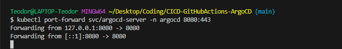

# **CI/CD for Monitoring Python App with GitHub Actions & ArgoCD**


## Things you will Learn 🤯

1. Developing a Monitoring Application in Python Using Flask and psutil
2. Executing a Python Application Locally
3. Building a Docker Image and Uploading to DockerHub for Continuous Integration with GitHub Actions Workflow
4. Crafting Deployment and Service Files for Kubernetes (K8s)
5. Setting Up and Implementing ArgoCD for Continuous Delivery

## **Prerequisites** 

(Things to have before starting the projects)

- [x]  Python3 installed.
- [x]  Dockerhub Account configured.
- [x]  Minikube installed.
- [x]  Code editor of your choice.
- [x]  GitBash installed.

# Let’s Start the Project 

## **Part 1: Deploying the Flask application locally**

### **Step 1: Clone the code**

Clone the code from the repository:

```
git clone <repository_url>
```

### **Step 2: Install dependencies**

The application uses the **`psutil`** and **`Flask`, Plotly** libraries. Install them using pip:

```
pip3 install -r requirements.txt
```

### **Step 3: Run the application**

To run the application, navigate to the root directory of the project and execute the following command:

```
python3 app.py
```

This will start the Flask server on **`localhost:5000`**. Navigate to [http://localhost:5000/](http://localhost:5000/) on your browser to access the application.


## **Part 2: Create a Dockerfile**

Create a **`Dockerfile`** in the root directory of the project with the following contents:

```
# Use the official Python image as the base image
FROM python:3.9-slim-buster

# Set the working directory in the container
WORKDIR /app

# Copy the requirements file to the working directory
COPY requirements.txt .

RUN pip3 install --no-cache-dir -r requirements.txt

# Copy the application code to the working directory
COPY . .

# Set the environment variables for the Flask app
ENV FLASK_RUN_HOST=0.0.0.0

# Expose the port on which the Flask app will run
EXPOSE 5000

# Start the Flask app when the container is run
CMD ["flask", "run"]
```

## **Part 3: Build and Push a DockerImage to your Dockerhub account**

### **Step 1: Store your secrets in your GitHub Repo**

You need to go to your DockerHub Account Settings -> Security -> New Access Token. A token will be created.

After that go to your github repo where you stored the project -> Settings -> Secrets and variables -> Actions -> New repository secret.

Secrets to be stored: DOCKERHUB_TOCKEN & DOCKERHUB_USERNAME.

### **Step 2: Write the workflow**
Create a folder in your project directory: .github/workflows and write the following workflow: 

```
name: CI with GitHub Actions

on:
  workflow_dispatch       # optional [push, workflow_dispatch]

jobs:
  Testing:
    runs-on: ubuntu-latest
    steps:
      - name: Checkout repository
        uses: actions/checkout@v4

      - name: Setup Python
        uses: actions/setup-python@v4
        with:
          python-version: 3.9

      - name: Install dependencies
        run: |
          python -m pip install --upgrade pip
          pip install -r requirements.txt

      - name: Run tests
        run: python -m unittest unittests.py


  SonarCloud:
    needs: Testing
    runs-on: ubuntu-latest
    steps:
      - name: Checkout repository
        uses: actions/checkout@v4

      - name: SonarCloud Analysis
        uses: sonarsource/sonarcloud-github-action@master
        env:
          GITHUB_TOKEN: ${{ secrets.GITHUB_TOKEN }}
          SONAR_TOKEN: ${{ secrets.SONAR_TOKEN }}


  Build_and_Publish:
    needs: SonarCloud
    runs-on: ubuntu-latest
    steps:
      - name: Checkout repository
        uses: actions/checkout@v4

      - name: Login to Docker Hub
        uses: docker/login-action@v3
        with:
          username: ${{ secrets.DOCKERHUB_USERNAME }}
          password: ${{ secrets.DOCKERHUB_TOCKEN }}

      - name: Setup Docker Buildx
        uses: docker/setup-buildx-action@v3

      - name: Build and push
        uses: docker/build-push-action@v5
        with:
          context: .
          file: ./Dockerfile
          push: true
          tags: ${{ secrets.DOCKERHUB_USERNAME }}/clockbox:latest


  SlackNotification:
    needs: Build_and_Publish
    runs-on: ubuntu-latest
    steps:
      - name: Send a Slack Notification
        if: always()
        uses: act10ns/slack@v2
        with:
          status: ${{ job.status }}
          steps: ${{ toJson(steps) }}
          channel: '#git'
        env:
          SLACK_WEBHOOK_URL: ${{ secrets.SLACK_WEBHOOK_URL }}
```
After that push your updated code to github. The workflow is going to be executed.

Go to your github repo and click on Actions. The workflow should have been successfully triggered and executed.


After that go to your DockerHub Account -> Repositories and you should see your uploaded DockerImage.


Congrats, if you made it so far. You have performed Continuous Integration on your own!


## **Part 4: Create Deployment and Service file for K8s**

```
apiVersion: apps/v1
kind: Deployment
metadata:
  name: flask-app
spec:
  replicas: 2  
  selector:
    matchLabels:
      app: flask-app
  template:
    metadata:
      labels:
        app: flask-app
    spec:
      containers:
      - name: flask-app
        image: teodor1006/clockbox:latest
        ports:
        - containerPort: 5000

---
apiVersion: v1
kind: Service
metadata:
  name: flask-app-service
spec:
  selector:
    app: flask-app
  ports:
    - protocol: TCP
      port: 80  
      targetPort: 5000
  type: NodePort   
```

You can create as much replicas as you want. Make sure to give your own image name here:

```
image: teodor1006/clockbox:latest 
```

## **Part 5: Install and Configure ArgoCD**

### **Step 1: Install ArgoCD**

Execute the following commands in GitBash:

```
minikube start
kubectl create ns argocd
kubectl apply -n argocd -f https://raw.githubusercontent.com/argoproj/argo-cd/v2.5.8/manifests/install.yaml
```
After applying ArgoCD manifest file from ArgoCD GitHub Repo you can type:

```
kubectl get pods -n argocd
```


Wait until your pods are up and running.

### **Step 2: Configure ArgoCD**

In order to access the web GUI of ArgoCD, we need to do a port forwarding. For that we will use the argocd-server service (But make sure that pods are in a running state before running this command).

```
kubectl port-forward svc/argocd-server -n argocd 8080:443
```



Now we can go to a browser and open localhost:8080 . 

You will see a privacy warning. Just ignore the warning, click on Advanced and then hit on Proceed to localhost (unsafe) to continue to the GUI interface. (Your browser setting may present a different option to continue).


To use ArgoCD interface, we need to enter our credentials. The default username is "admin" so we can enter it immediately, but we will need to get the initial password from ArgoCD through minikube terminal.

Initial password is kept as a secret in the argocd namespace; Therefore, we will use jsonpath query to retrieve the secret from the argocd namespace. We also need to decode it with base64. To do the both operations, just open a new terminal and enter the following code to do the trick for you. (Do not close the first terminal window as the port-forwarding is still alive)

```
kubectl -n argocd get secret argocd-initial-admin-secret -o jsonpath="{.data.password}" | base64 -d; echo
```


Copy the password, go back to your browser and enter it as password (username is admin). You should be in the GUI interface.


### **Step 3: Create Application file**

```
apiVersion: argoproj.io/v1alpha1
kind: Application
metadata:
  name: myapp-argo-application
  namespace: argocd
spec:
  project: default

  source:
    repoURL: https://github.com/teodor1006/cicd-gitops.git
    targetRevision: HEAD
    path: ./

  destination:
    server: https://kubernetes.default.svc
    namespace: default

  syncPolicy:
    syncOptions:
    - CreateNamespace=true

    automated:
      selfHeal: true
      prune: true
```

Push this file to your github repo. Make sure to replace the repoURL!!!

### **Step 4: Deploy the Python App**

Go to Gitbash and deploy the app:

```
kubectl apply -f application.yaml
```

You should then see the app in ArgoCD!


After that you can check the status of the App. It should be in healthy state.


### **Step 5: Access the website**

Open Gitbash and write the following:

```
kubectl get svc      # to see the port on which the app is exposed
minikube ip          # to check on what ip the app is running
```
After that go to your browser and type your ip and port to access the monitoring app.


Congrats!!! You did amazing job by managing a CI/CD process!!!!


## **Part 6: Clean up**

Run these commands:

```
kubectl delete -n argocd
minikube stop
minikube delete --all
```


